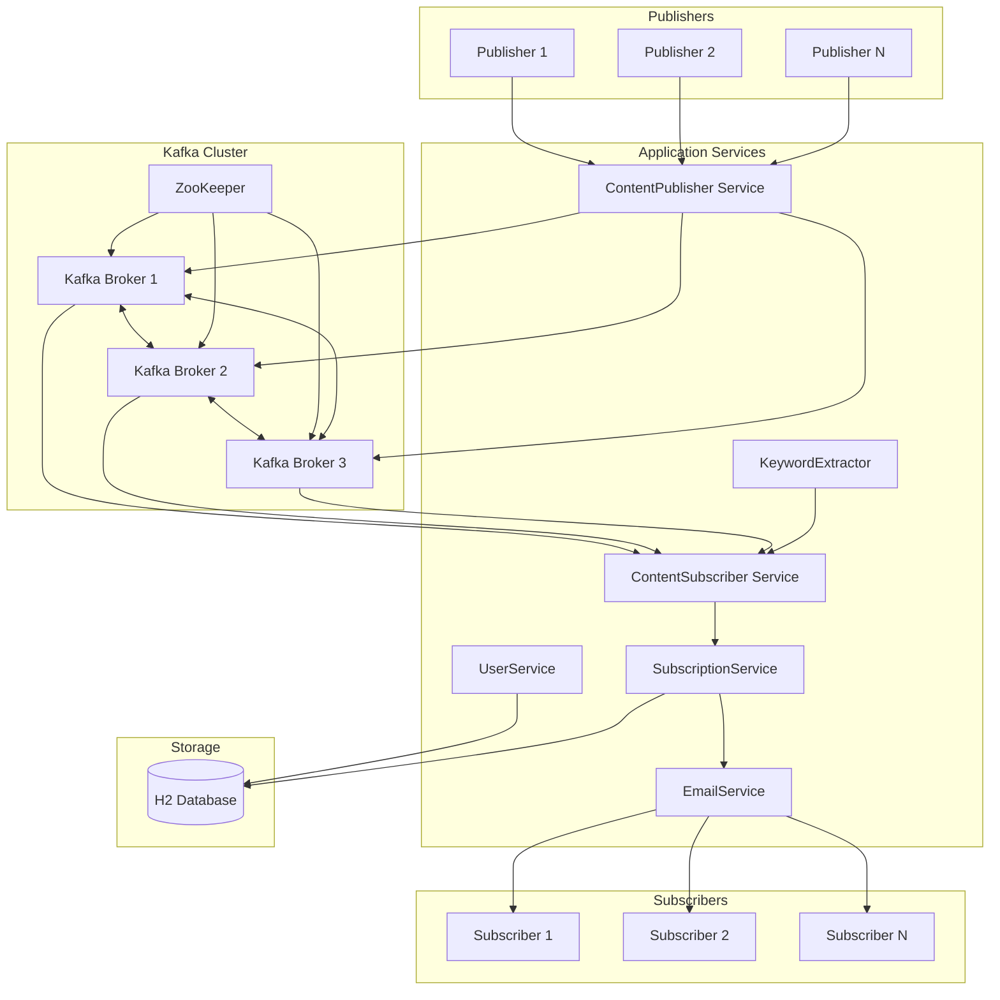
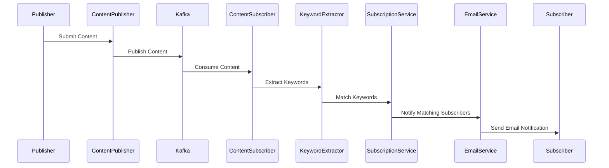
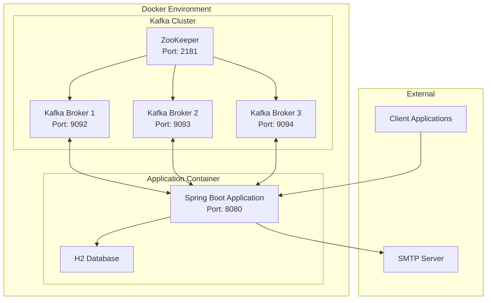
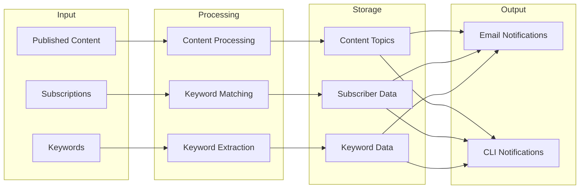

# System Architecture Documentation

## 1. High-Level System Architecture



## 2. Component Interaction Flow



## 3. Deployment Architecture



## 4. Data Flow Architecture



## 5. Fault Tolerance Design

```mermaid
graph TB
    subgraph Kafka Fault Tolerance
        B1[Broker 1] <--> B2[Broker 2]
        B2 <--> B3[Broker 3]
        B3 <--> B1
        
        subgraph Replication
            P1[Partition 1]
            P2[Partition 2]
            P3[Partition 3]
        end
        
        B1 --> P1
        B2 --> P2
        B3 --> P3
    end

    subgraph Application Resilience
        LB[Load Balancer]
        A1[App Instance 1]
        A2[App Instance 2]
        
        LB --> A1
        LB --> A2
    end

    subgraph Data Persistence
        DB1[(Primary DB)]
        DB2[(Backup DB)]
        
        DB1 <--> DB2
    end
